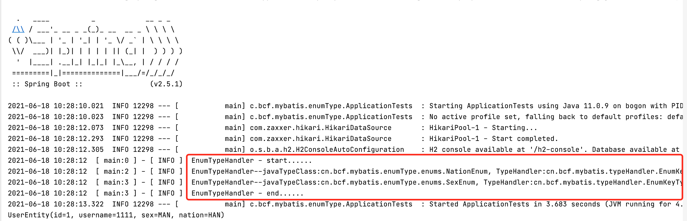
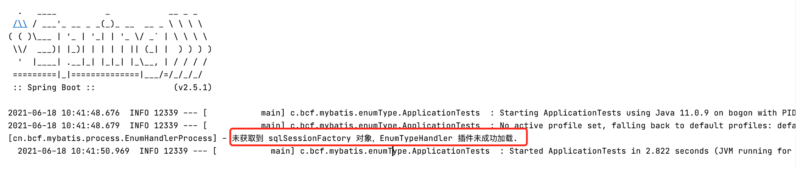

# EnumHandler

## 介绍

本项目是对 Mybatis 中枚举类型处理器的增强，新旧项目均可使用

## 有什么用

使用 Mybatis 时，对于 Integer 类型字段，不管是作为 parameterType 或是 resultType，Mybatis 都能优雅的处理。原理是 Mybatis 针对 Integer 实现了 Java 数据类型和 Jdbc
数据类型之间的转换规则，也就是 IntegerTypeHandler，也可称之为 Integer 类型处理器。

Mybatis 已经实现了很丰富的类型处理器，对于枚举类型，也提供了两种处理器：

- EnumTypeHandler：枚举名/枚举 Name
- EnumOrdinalTypeHandler：枚举顺序编号，从 1 开始

但我们业务中大部分都是类似下面的枚举

```java
public enum SexEnum {

    MAN(1, "男"),
    WOMAN(2, "女")
    ;

    public Integer key;
    public String value;

    SexEnum(Integer key, String value) {
        this.key = key;
        this.value = value;
    }

}
```

我们需要在数据库中存枚举类中的字段 key，这时候官方提供的处理器就不够用了。不过我们可以通过实现接口 TypeHandler，自定义枚举类型处理器，这样就能把 key 存放到数据库中。  
上述方法可行，但太过麻烦。本项目想要做的就是，**在 pom.xml 中引入依赖，再在枚举类上加上注解，然后这个枚举类就可以使用到 Mybatis 的类型处理器的功能，方便开发**。

## 怎么用

1. 引入依赖(已发布到公共 maven 仓库)

   ```java
   <dependency>
       <groupId>io.github.bichengfei</groupId>
       <artifactId>mybatis-enum-handler</artifactId>
       <version>1.0</version>
   </dependency>
   ```

2. 枚举类上加注解

   ```java
   import org.bcf.enumHandler.annotation.EnumHandler;
   
   @EnumHandler
   public enum SexEnum {
   
       MAN(1, "男"),
       WOMAN(2, "女")
       ;
   
       public Integer key;
       public String value;
   
       SexEnum(Integer key, String value) {
           this.key = key;
           this.value = value;
       }
   
   }
   ```

3. 查看插件是否成功加载

   
4. Github 项目目录下有测试用例[EnumTypeHandlerTest001](https://github.com/bichengfei/EnumHandler/tree/main/EnumTypeHandlerTest001)，采用 H2 内存数据库，clone/pull 下来后即可运行


## 原理

借用 Spring Boot 的 Spring.factories，在 EnumHandler 中获取到 Mybatis 的 SqlSessionFactory 对象，然后获取到所有用到注解 EnumHandler
的枚举类，自动把这些枚举类和指定的 TypeHandler 注入到 Mybatis 的类型处理器中。

## License

EnumTypeHandler is available under [Apache License 2.0](https://www.apache.org/licenses/LICENSE-2.0).

## FAQ

1. 是否会存在执行效率上的影响？

   会存在一些。当把数据库字段转为枚举的时候，会对枚举类进行反射处理，从数据库查出的结果有多少枚举，就会有多少次反射。不过从测试结果看来，性能影响微乎其微。

2. 当项目中未引入 Mybatis 依赖时，引入 EnumHandler 会出现问题吗？

   不会，日志会打印警告信息，但对项目运行不会产生影响

   

3. 为什么我添加了日志依赖和日志配置，依旧不打印日志？

   目前 EnumHandler 只支持 log4j

4. 对 Mybatis 版本有什么要求？

   TODO...

5. 对数据库有什么要求？

   理论支持任意数据库

6. 枚举类的变量名只能为 key 吗？可不可以是 code 或者其他任意字符串？任意类型可以吗？

   变量名可以不是 key，key 只是默认值，具体可以通过注解指定为任意字符串，例如：```@EnumHandler("code")```；任意类型不可以，当前版本只支持整形

7. 在非枚举类上使用了注解 EnumHandler，会出现什么问题？

   会打印出 warn 日志，对项目运行没有影响

8. 只有 Spring Boot 项目才可以使用这个插件吗？对 Spring Boot 版本有什么要求？

   是的。我在测试中使用的```2.5.1```没有问题，其他版本未测试

9. 不想每个枚举类都加上 ```@EnumHandler```，有没有一次设置，整个项目覆盖的方法？

   目前未提供这种配置，后续版本可能加上

   

   

   
